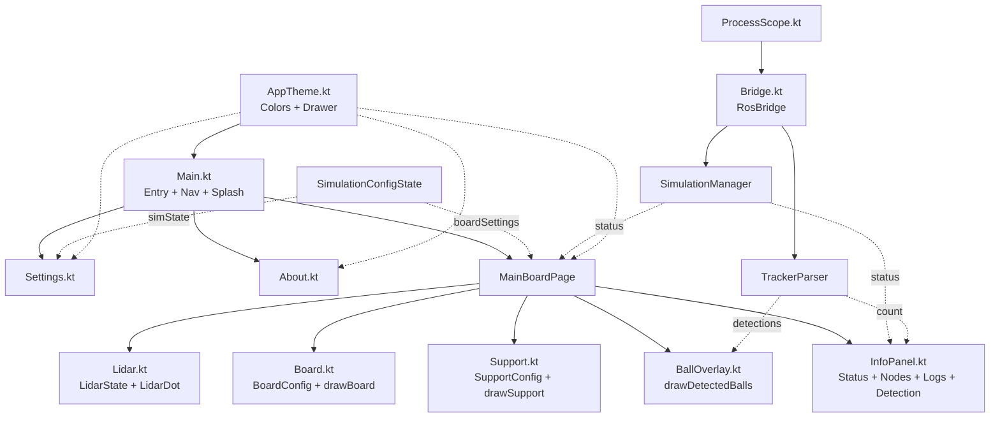

# Adapt Board

A Kotlin Compose Desktop application for the **adapt_display** ROS 2 Simulation System.

## Architecture



## Module Summary

| File | Responsibility |
|---|---|
| `Main.kt` | Entry point, splash screen, navigation, page composition |
| `AppTheme.kt` | Shared colors, `Page` enum, drawer composables |
| `Settings.kt` | Settings page with ROS 2 parameter cards |
| `About.kt` | About page |
| `Lidar.kt` | `LidarState` data class, `LidarDot` composable, `clampToGap()` |
| `Board.kt` | `BoardConfig` data class, `drawBoard()` DrawScope extension |
| `Support.kt` | `SupportConfig` data class, `drawSupport()` DrawScope extension |
| `InfoPanel.kt` | Right sidebar showing live sensor coordinates and status |
| `Bridge.kt` | `RosBridge` object — ROS 2 subprocess integration layer |

## Build & Run

```bash
cd /home/xanta/big_boulder/AdaptBoard
./gradlew build   # compile
./gradlew run     # launch
```
