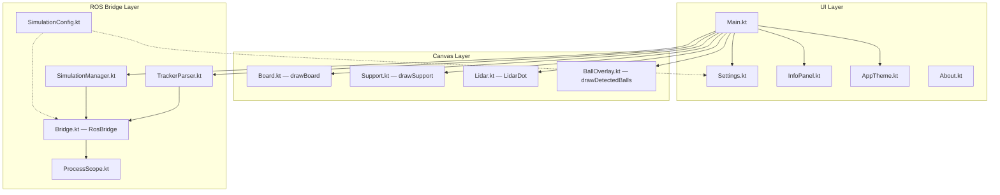

# AdaptBoard — Kotlin Desktop UI

> **Last updated**: 2026-03-05  
> **Location**: `/home/xanta/big_boulder/AdaptBoard/`  
> **Framework**: Compose Desktop (Kotlin/JVM)  
> **Build**: `./gradlew compileKotlinDesktop` (verify) or `./gradlew run` (launch)

---

## 1. Architecture Overview

AdaptBoard is a Compose Desktop application that provides a graphical interface for the `adapt_display` ROS 2 simulation. It communicates with ROS 2 entirely via **shell subprocesses** — no ROS libraries are used.



---

## 2. File-by-File Reference

### Core Application

| File | Responsibility |
|---|---|
| **Main.kt** | Entry point (`main()`), `SplashScreen`, `AdaptBoardApp` (nav + drawer), `MainBoardPage` (canvas + buttons), `ActionButton` composable |
| **AppTheme.kt** | `AppColors` object, `DrawerContent` (nav items + Launch/Stop Simulation button) |
| **Settings.kt** | `SettingsPage` (editable fields for all `SimulationConfig` params), `saveSettings()` suspend function (triggers `colcon build` if URDF params changed) |
| **About.kt** | Static about/info page |

### Canvas Components

| File | Responsibility |
|---|---|
| **Board.kt** | `BoardConfig` data class, `DrawScope.drawBoard()` — draws the opaque board rectangle |
| **Support.kt** | `SupportConfig` data class, `DrawScope.drawSupport()` — draws the dashed margin rectangle |
| **Lidar.kt** | `LidarState` data class (x, y, range, isLocked), `LidarDot` composable — draggable dot with gesture handling, range circle, coordinate display |
| **BallOverlay.kt** | `DrawScope.drawDetectedBalls()` — converts world-coord detections to canvas pixels, draws red dots with glow rings |

### ROS 2 Bridge Layer

| File | Responsibility |
|---|---|
| **Bridge.kt** | `RosBridge` object — static methods wrapping every ROS CLI call: `launchSimulation()`, `spawnSingleBall(config, offsetX, offsetY)`, `spawnMultipleBalls(n, config, offsetX, offsetY)`, `removeBalls(n)`, `startTracker(config)`, `buildPackage()`. Spawn methods accept world-meter offsets to shift spawn center from lidar origin to board/margin center. All use `runBash()` internally. |
| **ProcessScope.kt** | `ProcessScope.runAndWait(block)` — runs a subprocess on `Dispatchers.IO`, reads stdout+stderr on separate threads, returns `Result<String>` |
| **SimulationManager.kt** | `SimulationManager` class — manages Gazebo process lifecycle (`launch()`, `stop()`), exposes `status: SimStatus` and `errorMessage`. Monitors for unexpected termination. Kills process tree on stop. |
| **TrackerParser.kt** | `TrackerParser` class — runs `scan_tracker`, parses **stderr** for centroids and total count. Exposes `detections`, `frameCount`, `totalBallCount` as Compose state. Auto-starts/stops with simulation. |
| **SimulationConfig.kt** | `BallConfig`, `BoardSettings`, `LidarConfig`, `SimulationConfig` data classes. `SaveResult` sealed class. `SimStatus` enum. `SimulationConfigState` — mutable state wrapper with `needsRebuild()` and `markSaved()`. |

---

## 3. State Management

### SimulationConfigState
Wraps all config parameters as `mutableStateOf()`. Key behaviors:
- `needsRebuild()` → returns true if URDF-baked params changed (ball radius, ball mass, scan frequency)
- `markSaved()` → snapshots current config as `lastSavedConfig`
- Mutators enforce constraints (e.g., `boardWidth ≤ marginWidth`)

### SimulationManager
- `status`: `SimStatus.STOPPED | LAUNCHING | RUNNING | ERROR`
- `launch()`: starts Gazebo, waits 3s for early crash, then monitors in a separate coroutine
- `stop()`: kills the full process tree via `ProcessHandle.descendants()`, resets status
- `getProcessInputStream()`: exposes Gazebo stdout for the InfoPanel sim log

### TrackerParser
- `start(config, scope)`: launches `scan_tracker`, reads stderr line-by-line
- Publishes `detections: List<Pair<Float, Float>>` (current frame centroids)
- Publishes `totalBallCount: Int` (parsed from `Total Count: N` lines)
- `stop()`: kills process tree, resets all state

---

## 4. Canvas Coordinate System

- Canvas origin (0,0) is **top-left**
- The **dashed margin** rectangle is at fixed canvas fractions: `supportWFrac=0.56, supportHFrac=0.60`
- The **opaque board** scales proportionally within the margin based on `boardWidth/marginWidth` ratio
- The lidar dot is draggable; its `(x,y)` is in canvas pixels
- `BallOverlay` converts world-meter detections to canvas pixels using: `canvasX = lidarState.x + worldX * pxPerMeterX`

---

## 5. InfoPanel Sections

The right-hand sidebar (`InfoPanel.kt`) displays:

1. **Simulation Status** — colored dot + status text + error message
2. **Sensor Coordinates** — lidar world position converted from canvas pixels
3. **Lidar Range** — current range value + lock status
4. **Active Nodes** — polled every 5s via `ros2 node list` (only when RUNNING)
5. **Ball Detection** — total counted (bold), currently visible, scan frames
6. **Sim Log** — scrollable dark terminal-style panel streaming Gazebo stdout

---

## 6. Critical Design Decisions & Gotchas

### ROS2 logs to stderr
`RCLCPP_INFO`, `RCLCPP_WARN`, etc. all write to **stderr**. The TrackerParser reads `process.errorStream`. The old `redirectErrorStream(true)` was removed to allow separate error handling in `ProcessScope` and `saveSettings`.

### Process tree management
`Process.destroyForcibly()` only kills the direct child (bash shell). Gazebo, gzserver, gzclient, and ROS nodes are grandchildren. `SimulationManager.stop()` and `TrackerParser.stop()` use `ProcessHandle.descendants()` to kill the full tree.

### Pipe deadlock prevention
`ProcessScope.runAndWait()` reads stdout and stderr on **separate threads** concurrently. If only one stream is read, the other's OS pipe buffer can fill up and block the process.

### Dual-thread read pattern
```kotlin
val stdout = StringBuilder()
val stderr = StringBuilder()
val t1 = Thread { stdout.append(process.inputStream.bufferedReader().readText()) }
val t2 = Thread { stderr.append(process.errorStream.bufferedReader().readText()) }
t1.start(); t2.start()
t1.join(); t2.join()
```

### Save/rebuild logic
`saveSettings()` checks `needsRebuild()` (URDF-baked params: ball radius, mass, scan frequency). If rebuild needed → runs `colcon build` → shows Snackbar feedback. Otherwise saves instantly.

---

## 7. Adding New Features — Checklist

1. **New ROS parameter**: Add to `SimulationConfig.kt` data class → add field to `Settings.kt` UI → pass via `Bridge.kt` CLI string → add to Python/C++ `declare_parameter()`
2. **New ROS node**: Add `Bridge.kt` method → wire in `Main.kt` or `SimulationManager.kt` → register in `CMakeLists.txt` if C++
3. **New canvas visualization**: Create `DrawScope` extension in new file → call from `Canvas {}` block in `MainBoardPage`
4. **New InfoPanel section**: Add parameter to `InfoPanel` signature → add UI block → pass from `Main.kt`

---

## 8. Build Commands

```bash
# Verify Kotlin compilation
cd /home/xanta/big_boulder/AdaptBoard && ./gradlew compileKotlinDesktop

# Run the UI
cd /home/xanta/big_boulder/AdaptBoard && ./gradlew run

# Build ROS package (after source changes)
cd /home/xanta/big_boulder && source /opt/ros/humble/setup.bash && colcon build --packages-select adapt_display

# Source ROS workspace (needed for ros2 commands)
source /home/xanta/big_boulder/install/setup.bash
```
